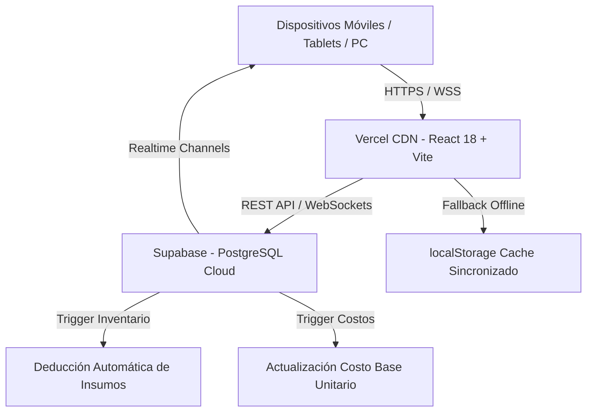

# 📋 REPORTE TÉCNICO E INTEGRAL DEL PROYECTO
## Delicias del Valle — Sistema Operativo y de Gestión Gastronómica

> **Fecha del Informe:** 1 de Septiembre, 2026  
> **Versión del Sistema:** 2.4.0 (Catálogo Maestro Exacto)  
> **Estado de Despliegue:** En Producción Activa (Vercel + Supabase)  
> **URL de Producción:** [delicias-del-valle.vercel.app](https://delicias-del-valle.vercel.app)  
> **Repositorio Oficial:** [github.com/stevencontreras09/delicias-del-valle](https://github.com/stevencontreras09/delicias-del-valle) (Rama: `main`)  
> **Moneda Operativa:** Pesos Dominicanos (`DOP` / `RD$`)  

---

## 1. Resumen Ejecutivo

**Delicias del Valle** es una aplicación web progresiva y sistema ERP/POS especializado para pastelerías y panaderías artesanales. El sistema digitaliza y automatiza toda la cadena de valor del taller:
- Control riguroso de compras y stock de **106 materias primas**.
- Costeo técnico y financiero en tiempo real de **60 recetas maestras (BOM)** con márgenes del 50% y sobrecostos operativos.
- Cotizador inteligente para clientes con presentaciones por **Libra, Porción o Minis con selector de cantidad exacta personalizada**.
- Control de pedidos con cobro 50/50 (anticipo y saldo) y **deducción automática del stock** de ingredientes al entrar en producción.
- Sincronización en tiempo real vía WebSockets entre múltiples dispositivos móviles y de escritorio.

Actualmente, el sistema se encuentra completamente limpio de datos ficticios, con su catálogo maestro de producción real cargado en **Supabase** y listo para operación comercial diaria.

---

## 2. Arquitectura Tecnológica

### Componentes del Stack:
- **Frontend:** React 18 (TypeScript), Vite 6, Tailwind CSS con paleta cálida gastronómica personalizada (`chocolate`, `crema`, `trigo`, `frambuesa`).
- **Iconografía & UI:** Lucide React, HTML5 Canvas para renderizado de vouchers/cotizaciones en imagen.
- **Backend & Base de Datos:** PostgreSQL en Supabase, Row Level Security (RLS) habilitado, Triggers en PL/pgSQL.
- **Sincronización:** Supabase Realtime (WebSockets) con canal único `delicias-live-sync-all`, reconexión automática en desbloqueo de pantalla (`visibilitychange`) y latido continuo (heartbeat) de 25 segundos.
- **Persistencia Híbrida:** Validación asíncrona en Supabase al iniciar sesión en dispositivos nuevos con respaldo en `localStorage` para continuidad ante caídas de red.

---

## 3. Estado Actual de la Base de Datos (Supabase)

La base de datos fue recientemente migrada y verificada con el catálogo maestro exacto extraído del Excel de costeo del taller:

| Tabla / Entidad | Registros Activos | Descripción y Rol en el Sistema |
| :--- | :---: | :--- |
| **`usuarios`** | **3** | Usuarios oficiales con control de acceso (RBAC): `Steven9909` (Admin Maestro), `Rmarpa` (Coadmin), `Vgarcia` (Coadmin). |
| **`insumos`** | **106** | Catálogo exhaustivo de materias primas con conversión a unidades base ($/g, $/ml, $/ud). |
| **`recetas`** | **60** | Recetas maestras (Tortas, Quesillos, Marquesas, Alfajores, Brownies, Panes, Galletas, Taquitos). |
| **`receta_ingredientes`** | **435** | Relaciones BOM detalladas con cantidades exactas en gramos, mililitros y unidades. |
| **`cotizaciones`** | **0** | Limpia de transacciones de prueba. Lista para emitir cotizaciones reales. |
| **`cotizacion_items`** | **0** | Ítems de cotización limpios. |
| **`pedidos`** | **0** | Limpia de transacciones de prueba. Lista para registrar pedidos y facturas reales. |
| **`pedido_items`** | **0** | Ítems de pedidos limpios. |
| **`pagos`** | **0** | Registro de anticipos y liquidaciones limpio. |
| **`mermas`** | **0** | Historial de desperdicios y pérdidas listo para operar. |
| **`configuracion_taller`** | **1** | Datos maestros del taller, teléfono WhatsApp (+1-809-555-0142), porcentajes financieros y moneda `RD$`. |

---

## 4. Estructura Financiera y Algoritmo de Costeo de Recetas

El taller calcula el costo y precio de venta mediante una fórmula integral que protege la rentabilidad:

$$\text{Costo Directo MPD} = \sum (\text{Cantidad Insumo} \times \text{Costo Unitario Base})$$

$$\text{Costo Primo Total} = \text{MPD} + \text{Merma Técnica (3\%)}$$

$$\text{Costos Indirectos y Operación} = \text{MPD} \times (10\% \text{ Ind.} + 15\% \text{ Oper.} + 10\% \text{ Rep. Equipos} + 30\% \text{ Mano de Obra}) = \text{MPD} \times 65\%$$

$$\text{Costo Total de Producción} = \text{Costo Primo Total} + \text{Costos Indirectos y Operación}$$

$$\text{Precio Sugerido Venta} = \frac{\text{Costo Total de Producción}}{1 - 0.50 \text{ (Margen 50\%)}}$$

### Divisiones de Presentación Implementadas:
1. **Formato Libra (Pasteles & Moldes):**
   - ½ LB (factor 0.5x), 1 LB (factor 1.0x), 2 LB (factor 2.0x), 3 LB (factor 3.0x).
2. **Formato Porción (Rebanadas Individuales):**
   - 1 Porción (factor 0.0833x), Pack x 4 (factor 0.3333x), Pack x 6 (factor 0.5x), Bandeja 12 porciones (factor 1.0x).
3. **Formato Mini (Bocaditos & Mesa de Dulces):**
   - Cajas estándar: 12 Minis (0.35x), 24 Minis (0.70x), 50 Minis (1.45x), 100 Minis (2.90x).
   - **Personalización Exacta de Minis (NUEVO):** Control numérico interactivo que permite ingresar **cualquier cantidad exacta de bocaditos** (ej: 15, 30, 36, 75, 120 minis) con cálculo dinámico del BOM y precio en tiempo real.

---

## 5. Módulos y Funcionalidades del Sistema

### A. Dashboard Ejecutivo
- Indicadores en tiempo real: Ventas del mes, balance pendiente por cobrar, pedidos en producción y alertas de insumos bajo stock mínimo.
- Accesos rápidos para cotizar, crear pedido o registrar merma.

### B. Módulo de Inventario de Insumos
- Listado de 106 insumos con búsqueda rápida, filtros por categoría y estado de existencias (stock bajo / normal).
- Registro individual de reabastecimiento con actualización opcional de precio de compra.
- Registro y auditoría de mermas técnicas con motivo (caducidad, quemado, derrame, error de pesado, calidad) y costo perdido.
- *Nota de diseño reciente:* Se eliminó el botón de abastecimiento masivo para evitar inflar el inventario artificialmente.

### C. Módulo de Recetas y Costeo (BOM)
- Catálogo de 60 recetas con categorización y agrupación por producto base (`nombre_base`).
- Modal de detalle con pestañas interactivas de presentación (Libra, Porción, Mini).
- Desglose detallado de ingredientes fijos (masa base) y variables (rellenos, coberturas, decoración).
- Generación de órdenes de producción técnicas para pasteleros con tiempos de horneado y preparación.

### D. Cotizador Inteligente (Wizard)
- Formulario guiado para armar propuestas de pedidos para clientes.
- Selección dinámica de masa, relleno y decoraciones con recargos por personalización.
- Módulo de agregados extras (topper personalizado, velas, flores naturales, empaque de regalo).
- Exportación visual de la cotización en formato de comprobante imprimible para compartir por WhatsApp.
- Botón directo para convertir una cotización aprobada en un **Pedido en Firme**.

### E. Módulo de Pedidos y Producción
- Seguimiento visual de pedidos clasificados por estado: *Confirmado*, *En Producción*, *Listo para Entrega*, *Entregado*.
- Cobro con esquema 50/50: Registro de anticipo para iniciar elaboración y saldo pendiente contra entrega.
- Generación automática de número de factura correlativo (`FAC-YYYYMMDD-XXXX`).
- Descuento automático de inventario mediante trigger de base de datos.
- Checklist de control de calidad previo a la entrega.

### F. Seguridad y Administración de Usuarios (RBAC)
- Inicio de sesión validado en tiempo real contra Supabase.
- Roles configurados: `admin` (acceso completo), `coadmin` (gestión operativa), `pastelero` (solo recetas y producción), `cajero` (cotizaciones, pedidos y pagos).
- Gestión de usuarios y cambios de contraseña.

---

## 6. Archivos y Recursos Críticos del Proyecto

| Archivo | Ubicación | Propósito |
| :--- | :--- | :--- |
| `delicias_del_valle_seed_EXACTO.sql` | Raíz, `/database`, `/public` | Script SQL maestro completo con el esquema DDL y el seed de 106 insumos, 60 recetas y 435 ingredientes. |
| `patch_recetas_exactas.sql` | Raíz, `/database`, `/public` | Script SQL de optimización para agregar `nombre_base`, índices y vistas agrupadas `v_recetas_agrupadas`. |
| `delicias_del_valle_backup.json` | Raíz, `/public` | Respaldo completo en formato JSON de toda la base de datos descargable. |
| `src/utils/initialData.ts` | `/src/utils` | Fuente de verdad local y caché offline con los 106 insumos y 60 recetas exactas. |
| `src/services/supabaseService.ts` | `/src/services` | Servicio centralizado de integración con la API de Supabase. |
| `src/context/AppContext.tsx` | `/src/context` | Estado global de React, sincronización Realtime (WebSockets) y listeners de visibilidad. |

---

## 7. Próximos Pasos Recomendados (Roadmap de Discusión con Gemini)

Para la siguiente fase de evolución del sistema, se sugieren los siguientes temas de análisis:

### 🔹 Prioridad 1: Aplicar `patch_recetas_exactas.sql` en Supabase
- Ejecutar el parche en el SQL Editor de Supabase para activar las columnas `nombre_base`, `es_variante_de` y las vistas `v_recetas_catalogo` y `v_recetas_agrupadas`.
- La aplicación web ya está programada para aprovechar estas columnas en cuanto estén activas.

### 🔹 Prioridad 2: Módulo de Clientes Frecuentes (Mini CRM)
- Registrar historial de clientes, teléfonos, direcciones frecuentes, fechas de cumpleaños de familiares y preferencias de sabores.
- Autocompletado del cliente al momento de cotizar para ahorrar tiempo en mostrador o WhatsApp.

### 🔹 Prioridad 3: Calendario de Producción Semanal / Timeline de Entregas
- Vista tipo calendario (semanal y mensual) para planificar qué tortas deben hornearse hoy, mañana y el fin de semana.
- Evitar saturación de capacidad del horno en fechas pico (San Valentín, Día de las Madres, Navidad).

### 🔹 Prioridad 4: Envío Automatizado por WhatsApp
- Integración con enlaces directos de `https://wa.me/` con texto preformateado conteniendo el resumen del pedido, monto del anticipo, cuenta bancaria para transferencia y estado de entrega.

### 🔹 Prioridad 5: Reporte de Rentabilidad Real y Flujo de Caja
- Módulo contable que compare las ventas cobradas vs. gastos reales registrados en compras de insumos para calcular la ganancia neta mensual del taller.

---

> **Conclusión:** El sistema Delicias del Valle se encuentra en un estado maduro, estable, 100% sincronizado con la base de datos en la nube y listo para gestionar las operaciones diarias del negocio.
